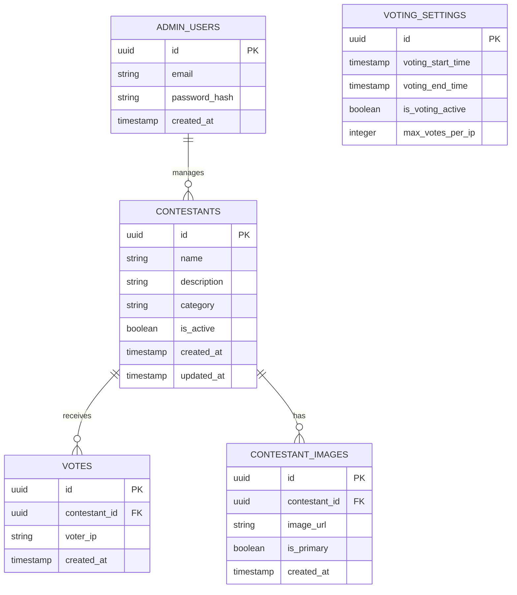

# ハロウィン仮装大会投票サイト - 技術アーキテクチャ

## 1. Architecture design

```mermaid
graph TD
  A[User Browser] --> B[React Frontend Application]
  B --> C[Supabase SDK]
  C --> D[Supabase Service]
  
  subgraph "Frontend Layer"
    B
  end
  
  subgraph "Service Layer (Provided by Supabase)"
    D --> E[PostgreSQL Database]
    D --> F[Authentication]
    D --> G[Storage (Images)]
    D --> H[Real-time Subscriptions]
  end
```

## 2. Technology Description

* Frontend: React\@18 + TypeScript + Tailwind CSS\@3 + Vite

* Backend: Supabase (Authentication, Database, Storage, Real-time)

* State Management: React Query + Zustand

* Image Handling: Supabase Storage

* Real-time Updates: Supabase Real-time subscriptions

## 3. Route definitions

| Route          | Purpose              |
| -------------- | -------------------- |
| /              | ホームページ、イベント概要と投票案内   |
| /contestants   | 候補者一覧ページ、全候補者表示と投票機能 |
| /vote-complete | 投票完了ページ、投票確認と暫定結果    |
| /results       | 結果発表ページ、リアルタイム順位表示   |
| /admin         | 管理者ページ、候補者管理と設定      |
| /admin/login   | 管理者ログインページ           |

## 4. API definitions

### 4.1 Core API

Supabaseを使用するため、直接的なREST APIではなく、Supabase SDKを通じたデータベース操作を行います。

**候補者データ取得**

```typescript
const { data: contestants } = await supabase
  .from('contestants')
  .select('*')
  .eq('is_active', true)
```

**投票実行**

```typescript
const { data, error } = await supabase
  .from('votes')
  .insert({
    contestant_id: contestantId,
    voter_ip: voterIp,
    created_at: new Date().toISOString()
  })
```

**リアルタイム投票数取得**

```typescript
supabase
  .channel('vote_counts')
  .on('postgres_changes', {
    event: 'INSERT',
    schema: 'public',
    table: 'votes'
  }, (payload) => {
    // 投票数更新処理
  })
  .subscribe()
```

## 5. Data model

### 5.1 Data model definition



### 5.2 Data Definition Language

**候補者テーブル (contestants)**

```sql
-- create table
CREATE TABLE contestants (
    id UUID PRIMARY KEY DEFAULT gen_random_uuid(),
    name VARCHAR(100) NOT NULL,
    description TEXT,
    category VARCHAR(50) DEFAULT 'その他',
    is_active BOOLEAN DEFAULT true,
    created_at TIMESTAMP WITH TIME ZONE DEFAULT NOW(),
    updated_at TIMESTAMP WITH TIME ZONE DEFAULT NOW()
);

-- create index
CREATE INDEX idx_contestants_active ON contestants(is_active);
CREATE INDEX idx_contestants_category ON contestants(category);

-- RLS policies
ALTER TABLE contestants ENABLE ROW LEVEL SECURITY;
GRANT SELECT ON contestants TO anon;
GRANT ALL PRIVILEGES ON contestants TO authenticated;
```

**投票テーブル (votes)**

```sql
-- create table
CREATE TABLE votes (
    id UUID PRIMARY KEY DEFAULT gen_random_uuid(),
    contestant_id UUID REFERENCES contestants(id) ON DELETE CASCADE,
    voter_ip INET NOT NULL,
    created_at TIMESTAMP WITH TIME ZONE DEFAULT NOW()
);

-- create index
CREATE INDEX idx_votes_contestant_id ON votes(contestant_id);
CREATE INDEX idx_votes_voter_ip ON votes(voter_ip);
CREATE INDEX idx_votes_created_at ON votes(created_at DESC);

-- 重複投票防止のユニーク制約
CREATE UNIQUE INDEX idx_votes_unique_ip_contestant ON votes(voter_ip, contestant_id);

-- RLS policies
ALTER TABLE votes ENABLE ROW LEVEL SECURITY;
GRANT SELECT, INSERT ON votes TO anon;
GRANT ALL PRIVILEGES ON votes TO authenticated;
```

**候補者画像テーブル (contestant\_images)**

```sql
-- create table
CREATE TABLE contestant_images (
    id UUID PRIMARY KEY DEFAULT gen_random_uuid(),
    contestant_id UUID REFERENCES contestants(id) ON DELETE CASCADE,
    image_url TEXT NOT NULL,
    is_primary BOOLEAN DEFAULT false,
    created_at TIMESTAMP WITH TIME ZONE DEFAULT NOW()
);

-- create index
CREATE INDEX idx_contestant_images_contestant_id ON contestant_images(contestant_id);
CREATE INDEX idx_contestant_images_primary ON contestant_images(is_primary);

-- RLS policies
ALTER TABLE contestant_images ENABLE ROW LEVEL SECURITY;
GRANT SELECT ON contestant_images TO anon;
GRANT ALL PRIVILEGES ON contestant_images TO authenticated;
```

**投票設定テーブル (voting\_settings)**

```sql
-- create table
CREATE TABLE voting_settings (
    id UUID PRIMARY KEY DEFAULT gen_random_uuid(),
    voting_start_time TIMESTAMP WITH TIME ZONE,
    voting_end_time TIMESTAMP WITH TIME ZONE,
    is_voting_active BOOLEAN DEFAULT false,
    max_votes_per_ip INTEGER DEFAULT 1,
    created_at TIMESTAMP WITH TIME ZONE DEFAULT NOW(),
    updated_at TIMESTAMP WITH TIME ZONE DEFAULT NOW()
);

-- RLS policies
ALTER TABLE voting_settings ENABLE ROW LEVEL SECURITY;
GRANT SELECT ON voting_settings TO anon;
GRANT ALL PRIVILEGES ON voting_settings TO authenticated;

-- 初期データ
INSERT INTO voting_settings (is_voting_active, max_votes_per_ip) 
VALUES (false, 1);
```

**投票数集計ビュー**

```sql
-- 投票数集計用のビュー
CREATE VIEW vote_counts AS
SELECT 
    c.id,
    c.name,
    c.category,
    c.description,
    ci.image_url,
    COALESCE(v.vote_count, 0) as vote_count
FROM contestants c
LEFT JOIN contestant_images ci ON c.id = ci.contestant_id AND ci.is_primary = true
LEFT JOIN (
    SELECT contestant_id, COUNT(*) as vote_count
    FROM votes
    GROUP BY contestant_id
) v ON c.id = v.contestant_id
WHERE c.is_active = true
ORDER BY vote_count DESC, c.name;

-- ビューの権限設定
GRANT SELECT ON vote_counts TO anon;
GRANT SELECT ON vote_counts TO authenticated;
```

