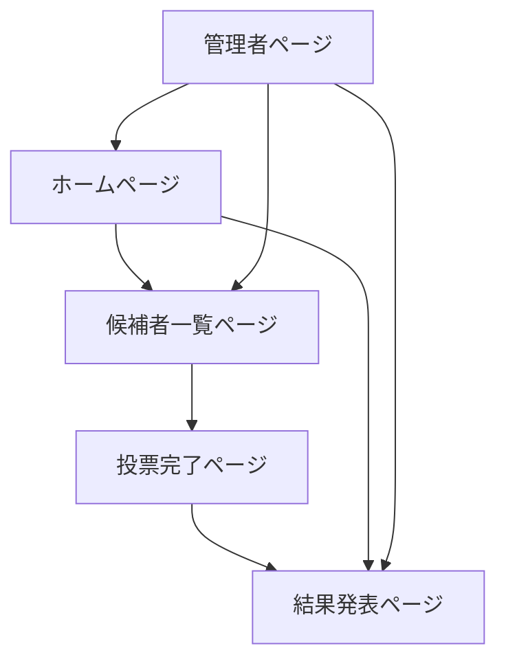

# ハロウィン仮装大会投票サイト - 製品要件書

## 1. Product Overview
300人規模のハロウィンイベントで開催される仮装大会の専用投票サイトです。参加者の仮装写真をアップロードし、イベント来場者やオンライン参加者が投票できるプラットフォームを提供します。
リアルタイムでの投票集計と結果表示により、イベントの盛り上がりを最大化し、参加者全員が楽しめる仮装大会の実現を目指します。

## 2. Core Features

### 2.1 User Roles
| Role | Registration Method | Core Permissions |
|------|---------------------|------------------|
| 管理者 | 事前設定済みアカウント | 候補者登録、写真アップロード、投票管理、結果確認 |
| 投票者 | 登録不要（匿名投票） | 候補者閲覧、投票実行 |
| 候補者 | 管理者による登録 | 自分の情報確認のみ |

### 2.2 Feature Module
仮装大会投票サイトは以下の主要ページで構成されます：
1. **ホームページ**: イベント概要、投票案内、候補者一覧プレビュー
2. **候補者一覧ページ**: 全候補者の写真と基本情報、投票ボタン
3. **投票完了ページ**: 投票確認、結果プレビュー
4. **結果発表ページ**: リアルタイム投票結果、ランキング表示
5. **管理者ページ**: 候補者管理、写真アップロード、投票設定

### 2.3 Page Details
| Page Name | Module Name | Feature description |
|-----------|-------------|---------------------|
| ホームページ | ヒーローセクション | イベントタイトル、開催日時、投票期間の表示 |
| ホームページ | 投票案内 | 投票方法の説明、注意事項の表示 |
| ホームページ | 候補者プレビュー | 注目候補者3-5名のサムネイル表示 |
| 候補者一覧ページ | 候補者グリッド | 全候補者の写真、名前、コスチューム説明をカード形式で表示 |
| 候補者一覧ページ | 投票機能 | 各候補者への投票ボタン、重複投票防止 |
| 候補者一覧ページ | フィルター機能 | カテゴリー別（オリジナル、アニメ、映画等）での絞り込み |
| 投票完了ページ | 投票確認 | 投票した候補者の確認、投票完了メッセージ |
| 投票完了ページ | 結果プレビュー | 現在の暫定順位、総投票数の表示 |
| 結果発表ページ | ランキング表示 | 1位から順位別の候補者表示、得票数 |
| 結果発表ページ | リアルタイム更新 | 自動更新による最新結果の反映 |
| 管理者ページ | 候補者管理 | 候補者の追加、編集、削除機能 |
| 管理者ページ | 写真アップロード | 候補者写真の一括・個別アップロード |
| 管理者ページ | 投票設定 | 投票期間設定、投票制限設定 |

## 3. Core Process

**管理者フロー:**
1. 管理者ログイン
2. 候補者情報の登録（名前、カテゴリー、説明）
3. 候補者写真のアップロード
4. 投票期間の設定
5. 投票開始
6. リアルタイム結果監視
7. 投票終了・結果確定

**投票者フロー:**
1. サイトアクセス
2. ホームページでイベント概要確認
3. 候補者一覧ページで全候補者閲覧
4. お気に入り候補者への投票
5. 投票完了確認
6. 結果発表ページで順位確認

## 4. User Interface Design
### 4.1 Design Style
- **プライマリカラー**: オレンジ (#FF6B35) - ハロウィンテーマ
- **セカンダリカラー**: パープル (#6A4C93) - 神秘的な雰囲気
- **アクセントカラー**: ゴールド (#FFD700) - 特別感演出
- **ボタンスタイル**: 丸角ボタン（border-radius: 8px）、ホバー時のアニメーション
- **フォント**: Noto Sans JP（日本語）、サイズ16px（本文）、24px（見出し）
- **レイアウト**: カードベースデザイン、上部固定ナビゲーション
- **アイコン**: ハロウィンテーマ（かぼちゃ、おばけ、星など）

### 4.2 Page Design Overview
| Page Name | Module Name | UI Elements |
|-----------|-------------|-------------|
| ホームページ | ヒーローセクション | 大きなタイトル、ハロウィン背景画像、オレンジのグラデーション |
| ホームページ | 候補者プレビュー | 円形写真、ホバー時拡大エフェクト、投票数バッジ |
| 候補者一覧ページ | 候補者グリッド | 3列グリッドレイアウト、カードシャドウ、投票ボタン |
| 候補者一覧ページ | フィルター | ドロップダウンメニュー、選択状態の視覚化 |
| 投票完了ページ | 確認メッセージ | 大きなチェックマーク、アニメーション効果 |
| 結果発表ページ | ランキング | 1位は王冠アイコン、プログレスバーで得票率表示 |
| 管理者ページ | アップロード | ドラッグ&ドロップエリア、プログレスバー |

### 4.3 Responsiveness
モバイルファーストデザインを採用し、スマートフォンでの投票体験を最適化します。タッチ操作に配慮したボタンサイズ（最小44px）、スワイプジェスチャーによる候補者切り替え機能を実装します。